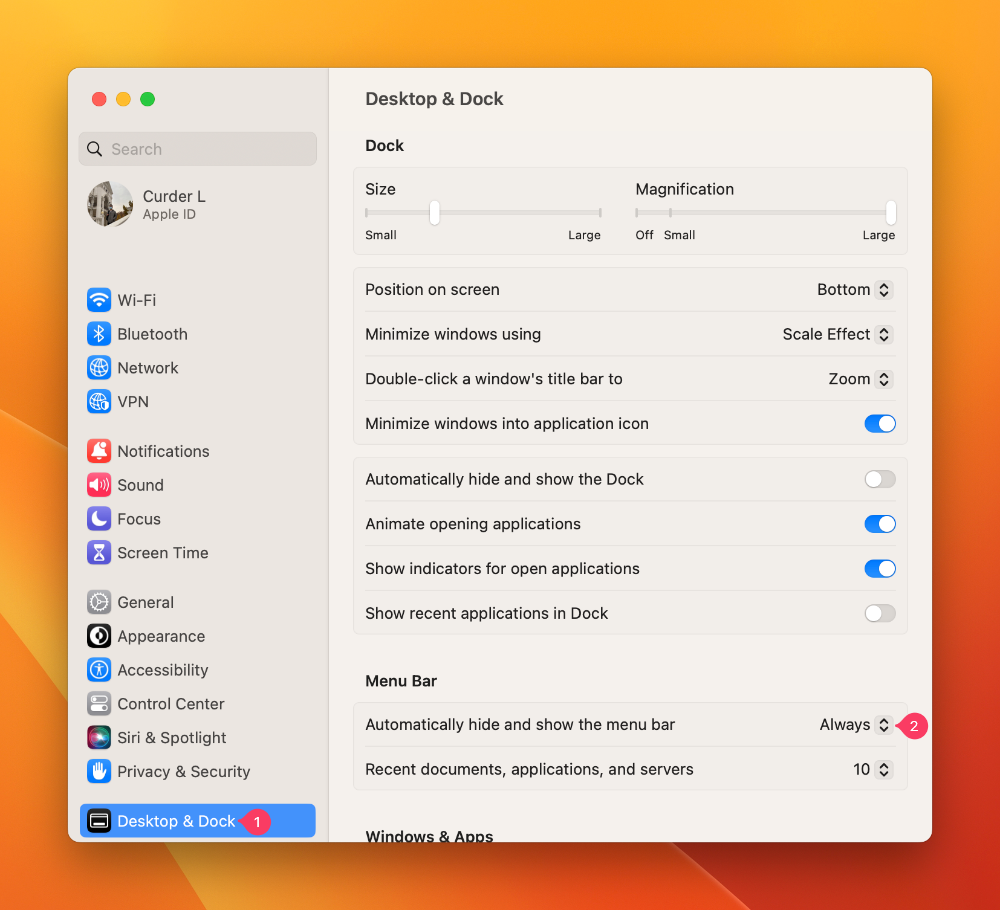

# 切换 Mac 工具栏和菜单显示状态

## 切换底部Dock隐藏和显示状态

`系统设置` -> `桌面与程序坞` -> `自动显示和隐藏程序坞` 切换它的状态。


或者使用下面的快捷键：

```txt
Command + Alt + D
```

## 切换顶部菜单栏显示和隐藏状态

`系统设置` -> `桌面与程序坞` -> `自动显示和隐藏菜单栏` -> 选择 `始终` 则可以隐藏。




