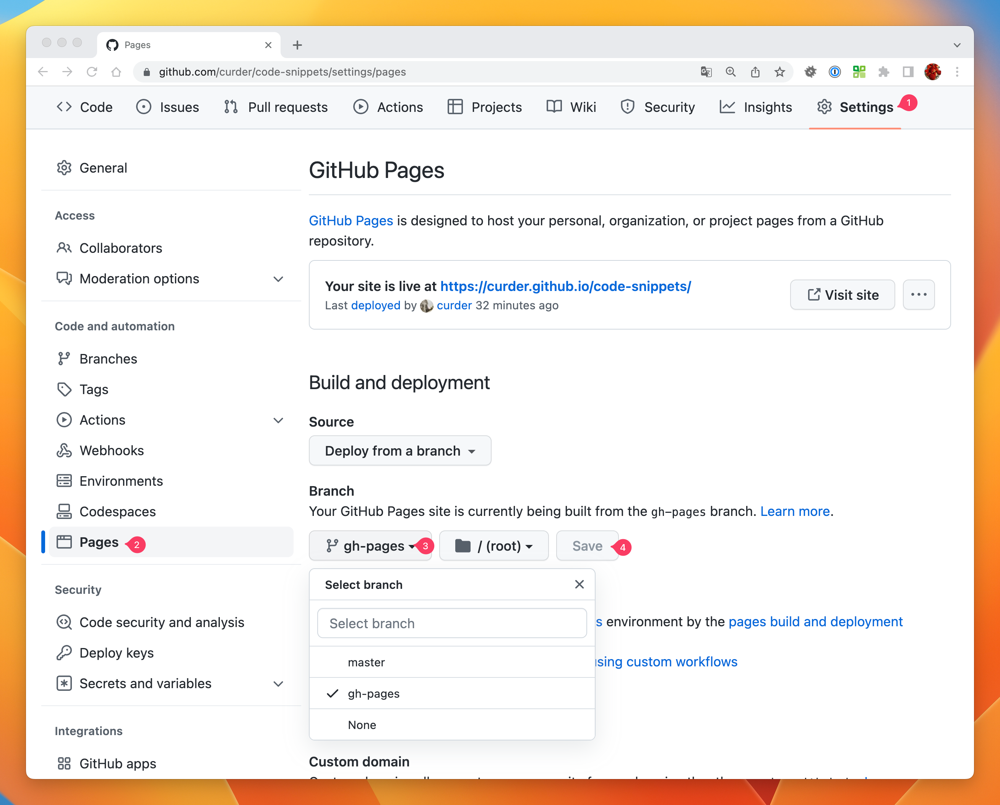
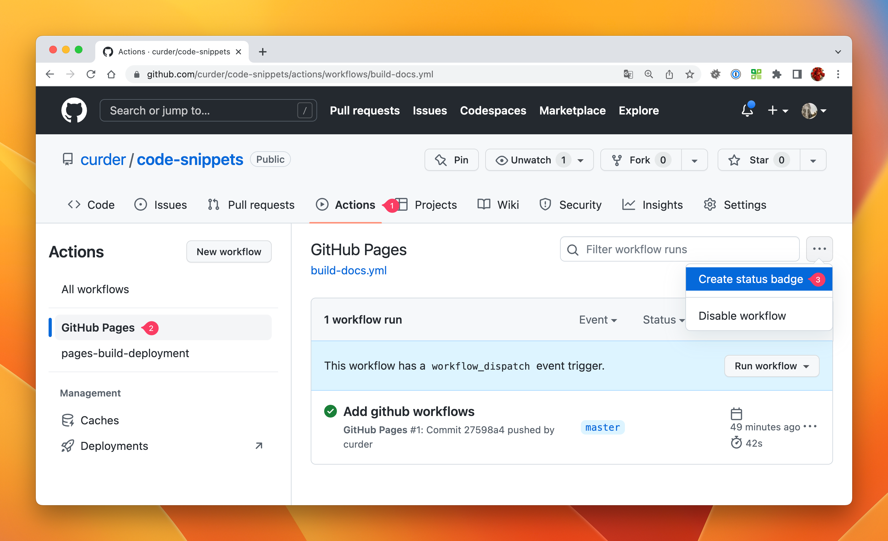

# VitePress 初始化

经常需要在本地创建 [VitePress](https://vitepress.vuejs.org/guide/getting-started) 项目来编写文档记录一些代码、经验或总结。

## 创建项目目录

```bash
project_name='code-snippets' # 假定项目名称是 code-snippets

mkdir $project_name && cd $project_name # 创建并更改为新目录
```

然后，使用 [yarn](https://yarnpkg.com/) 包管理器进行初始化。

```bash
yarn init
```

一般情况执行完成上面的命令后一直按回车使用默认值会生成默认的内容。

::: details 点击查看默认生成的内容
```json
{
  "name": "code-snippets",
  "description": "Record some code snippets at work.",
  "repository": "https://github.com/curder/code-snippets.git",
  "author": "curder <q.curder@gmail.com>",
  "license": "MIT"
}
```
:::

## 安装 VitePress

将 VitePress 和 Vue 作为项目的依赖。

```bash
yarn add -D vitepress vue

# 创建第一个文档
mkdir docs && echo '# Hello VitePress' > docs/README.md
echo '<!--@include: ./README.md-->' > docs/index.md
```

## 启动开发环境

添加配置到 `package.json` 文件，这些配置用于在本地执行命令，比如：

```json
{
  "name": "code-snippets",
  "description": "Record some code snippets at work.",
  "repository": "https://github.com/curder/code-snippets.git",
  "author": "curder <q.curder@gmail.com>",
  "license": "MIT",
  "scripts": { // [!code focus]
    "docs:dev": "vitepress dev docs", // [!code focus]
    "docs:build": "vitepress build docs", // [!code focus]
    "docs:preview": "vitepress preview docs" // [!code focus]
  }, // [!code focus]
  "devDependencies": {
    "vitepress": "^1.0.0-alpha.47",
    "vue": "^3.2.47"
  }
}
```

```bash
# 在本地环境执行下面的命令编译项目。
yarn docs:dev

# 生成环境使用
yarn docs:build
```

VitePress 将在 [localhost:5173](http://localhost:5173) 启动热重载开发服务器。

## 添加个性化配置

使用下面的命令在 `docs/.vitepress/` 目录下创建 `config.ts` 文件，用于个性化当前 VitePress 项目：

```bash
touch docs/.vitepress/config.ts
```

大致的内容如下：

```ts
import {defineConfig} from 'vitepress'

export default defineConfig({
    lang: "zh-CN",
    base: "/code-snippets/",
    title: "代码片段",
    description: "记录一些工作中常用的代码片段。",
    lastUpdated: true,
    themeConfig: {
        logo: "",
        siteTitle: "代码片段",
        outline: {
            label: "章节导航",
            level: 'deep',
        },
        lastUpdatedText: "最后更新时间",
        docFooter: {
            prev: '上一页',
            next: '下一页'
        },
        editLink: {
            pattern: "https://github.com/curder/code-snippets/edit/master/docs/:path",
            text: '编辑它'
        },
        socialLinks: [
            {icon: 'github', link: 'https://github.com/curder/code-snippets'}
        ],
        nav: nav(),
        sidebar: {
            "/guide": sidebarGuide(),
        }
    }
});


function nav()
{
    return [
        //
    ];
}

function sidebarGuide()
{
    return [
        //
    ];
}
```

## 添加 GitHub Action

如果代码仓库是放在 [GitHub](https://github.com/curder) 上，可以直接将代码部署到 `github.io` 上。

### 添加配置文件
```bash
# 创建构建文档的配置文件
mkdir -p .github/workflows && touch .github/workflows/build-docs.yml
```

并将下面的内容添加到 `./.github/workflows/build-docs.yml` 文件中。

::: details 点击查看 GitHub Action 配置文件
```yaml
# github pages: https://github.com/marketplace/actions/github-pages-action#table-of-contents
# How to cache node_modules in GitHub Actions with Yarn: https://dev.to/mpocock1/how-to-cache-nodemodules-in-github-actions-with-yarn-24eh

name: GitHub Pages

on:
  push:
    branches:
      - master
  # trigger deployment manually
  workflow_dispatch:

jobs:
  build-docs:
    runs-on: ubuntu-22.04
    permissions:
      contents: write
    concurrency:
      group: ${{ github.workflow }}-${{ github.ref }}
    steps:
      - uses: actions/checkout@v3
        with:
          # fetch all commits to get last updated time or other git log info
          fetch-depth: 0

      - name: Setup Node
        uses: actions/setup-node@v3
        with:
          node-version: '16.x'

      - name: Get yarn cache
        id: yarn-cache
        run: echo "YARN_CACHE_DIR=$(yarn cache dir)" >> "${GITHUB_OUTPUT}"

      - name: Cache dependencies
        uses: actions/cache@v3
        with:
          path: ${{ steps.yarn-cache.outputs.YARN_CACHE_DIR }}
          key: ${{ runner.os }}-yarn-${{ hashFiles('**/yarn.lock') }}
          restore-keys: |
            ${{ runner.os }}-yarn-

      - name: Install packages
        if: steps.yarn-cache.outputs.cache-hit != 'true'
        run: yarn --frozen-lockfile

      # run build script
      - name: Build VitePress site
        run: yarn docs:build

      - name: Deployment
        uses: peaceiris/actions-gh-pages@v3
        with:
          github_token: ${{ secrets.GITHUB_TOKEN }}
          publish_dir: ./docs/.vitepress/dist
```
:::

经过上面的配置后在推送代码到 `master` 分支时会直接触发部署功能，部署到 `gh-pages` 新分支。

### 设置默认Pages分支

通过在项目的 `Settings` -> `Pages` -> `Branch`，比如这里的 [Pages](https://github.com/curder/code-snippets/settings/pages) 中的 Branch 分支选择 **`gh-pages`**，等待一段时间就可以看到项目部署到了 [YOUR_GITHUB_USERNAME.github.io/PROJECT_NAME](https://curder.github.io/code-snippets/)。



### 添加构建状态

- 获取构建状态
    
    在 GitHub 项目仓库下选择 `Actions` -> `GitHub Pages` -> `Create status badge`，点击按钮后复制弹出层中的构建 markdown 内容。
    

- 构建的 markdown 内容 [YOUR_GITHUB_USERNAME/PROJECT_NAME](https://github.com/curder/code-snippets/actions/workflows/build-docs.yml)

    ```markdown
    [](https://github.com/curder/code-snippets/actions/workflows/build-docs.yml)
    ```
  
- 将构建状态放到项目首页文件

    将上面复制的内容可以通过编辑器写入到 `docs/README.md` 文件中，也可以通过下面的命令追加到文件的末尾。

    ```bash
    echo '[](https://github.com/curder/code-snippets/actions/workflows/build-docs.yml)' >> docs/README.md
    ```

以上是针对使用 VitePress 写文档的一些经常使用到的流程。